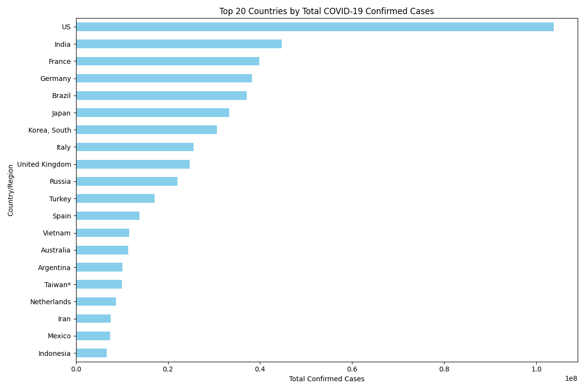

# Global COVID-19 Time-Series Analyzer (2025 Refresh)



A clean, production-grade Python script that:
- Downloads the latest Johns Hopkins CSSE COVID-19 global time-series data
- Aggregates confirmed cases by country using the most recent date
- Visualizes the top 20 countries with a readable horizontal bar chart
- Fully error-handled and modular — written with senior-level patterns

## Why I built this
Personal upskilling project to stay sharp on:
- pandas data cleaning & aggregation
- matplotlib visualization best practices
- Real-world API/CSV handling
- Debugging workflows using Continue (local LLM), Grok, and PyCharm

Demonstrates iterative development: started with a local 3B model → identified hallucinations → refined with stronger reasoning tools → shipped working code.

## How to run
```bash
pip install pandas matplotlib requests
python covid_global_analysis.py
